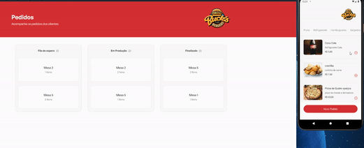
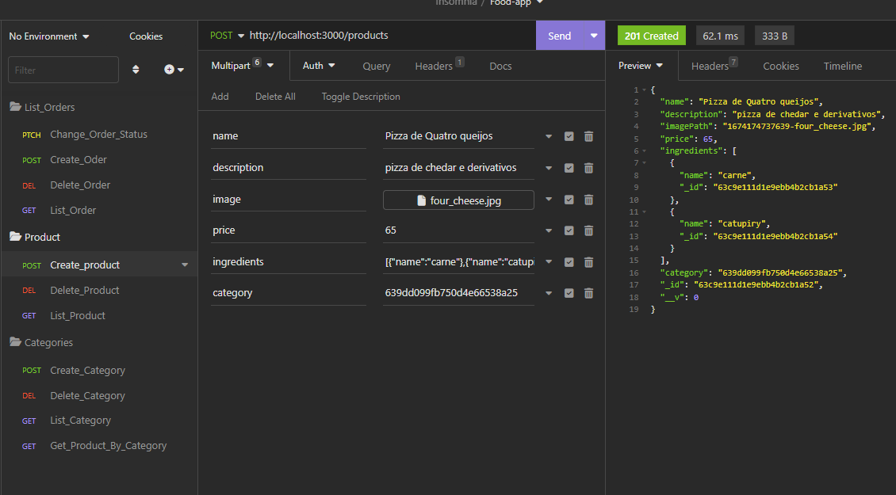

<h1>Bucker's Burger</h1>

<div align="center">
  
  
  
  
  
  
  
  
</div>
<br>

<br>

<br>

## Demonstration



<br>

### Topics

:small_blue_diamond: [Project Description](#descrição-do-projeto-page_with_curl)

:small_blue_diamond: [Functionalities](#funcionalidades-heavy_check_mark)

:small_blue_diamond: [Functionalities in Open](#funcionalidades-em-aberto-warning)

:small_blue_diamond: [how run the aplication](#como-rodar-a-aplicação-arrow_forward)

<br>

## Project describs :page_with_curl:

<p align="justify">
  
</p>

## Dependencies

 - Express
 - Nodemon
 - Ts-node
 - Mongoose
 - Axios

## Database

- Mongodb

## Libary

- Multer
- Styled Componets

## Tools

- <a href="https://www.docker.com/">Docker</a>
- <a href="https://vitejs.dev/">Vite</a>
- <a href="https://developer.mozilla.org/pt-BR/docs/Web/API/WebSockets_API">WebSocket</a>
- <a href="https://insomnia.rest/download">Insomnia</a>
- <a href="https://developer.android.com/studio">Android Studio</a>

## Technology

- React
- Typescript
- React Native

## Funcionalidades :heavy_check_mark:

- [X] Gerenciamento de pedidos.
- [X] Cancelamento e confirmação.

## Functionalities in Open :warning:

- [ ] Product register.
- [ ] Product delete.
- [ ] Categories register.
- [ ] Categories delete.


## How run aplication :arrow_forward:

## Step 1

- Install <a href="https://insomnia.rest/download">Insomnia</a>
- Install <a href="https://www.docker.com/">Docker</a>
- Install <a href="https://developer.android.com/studio">Android Studio</a>

## Step 2

- Open Android Studio and create Virtual Device
- Open Insomnia

### Create Folder and GET, POST, DEL, GET


<br>
<br>

Insert URLs 

Orders 

```
http://localhost:3000/orders/
```

Products

```
http://localhost:3000/products
```

Categories

```
http://localhost:3000/categories/
```

Get Product by category
#### substitute ID as Correct ID

```
http://localhost:3000/categories/{ID}/products
```

## Step 3

Clone the repository:

```
git clone https://github.com/rafaelpereirafront/food-app-native.git
```

Enter the project folder:

```
cd lanchonete
```

Install the dependecies: 

```
npm install
```
Open the Docker and install MongoDb image: 
```
docker pull mongo
```

Install Database Image:

```
docker pull rafaelpereirarj/mongo:db
```

Enter the API folder: 

```
cd api

npm run dev
```

Enter the Web Dashboard folder: 

```
cd fe

npm run dev
```

Start the Android emulator: 

```
cd app

npm start

npx react-native run-android
```
